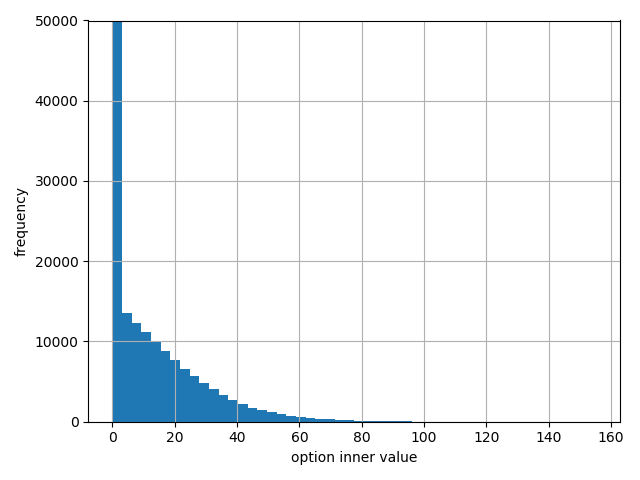

## 0. 隐含波动率、蒙特卡洛模拟与技术分析
文件夹下放了三个demo

#### 一、隐含波动率 implied volatility
根据Black-Scholes-Mertion的期权定价公式，在`bsm_functions.py`中实现。在代码中，波动率不是代入到模型或公式中的一个输入参数，而是根据公式得到的一个数值优化过程。BSM公式如下图。

假设某项欧式看涨期权的报价C*已给定，则隐含波动率是可以求解BSM公式的波动率数值。由于该方程没有显示解，需要使用牛顿法来逼近，公式如下。

我们需要求得期权的Vega，即波动率的一阶导数，公式如下。

基于上述公式，我们实现了相关函数，并在main函数中调用。

**数据源**: Eurex基于VSTOXX和各种期货合同的衍生品交易市场，它建立了一个基于VSTOXX波动率指数的衍生品合同教程。我们采用该指数的部分数据源，存放在resource下的h5文件。

- 先使用pandas将VSTOXX指数的h5文件读入，分别将期货数据futures_data和期权数据options_data读入。其中期货数据由到期日唯一描述，期权数据由到期日和执行价格唯一描述。
- 交易的看涨期权有非常实值的（即指数水平比期权执行价格高很多），也有非常虚值的（即指数水平比期权执行价格低很多）。因此，我们希望将分析限制在某种给定的（远期）moneyness水平，给定分别期限的期货价值。假设我们允许期货水平50%上下波动。并使用我们定义好的波动率计算函数来计算看涨期权的隐含波动率，并存在新的一列IMP_VOL。
- 我们选择期权隐含波动率大于0的子集，也就是进行了隐含波动率计算的子集。再对所有到期日进行迭代，将隐含波动率绘图可视化。因为到期日显示为多个时间，我们使用set操作去重，再对set进行排序。最后对所有日期迭代绘图，可以看到波动率微笑图形，对于长期期权来说更为明显。
- DataFrame对象options_data都有一个整数索引，但是这个索引没有意义。而期权报价可以通过期限和执行价格来唯一描述，也就是说每个到期日的每个执行价格都对应着一个唯一的看涨期权。因此我们使用groupby方法得到一个根据MATURITY和STRIKE索引的PRICE和IMP_VOL列，然后进行加总操作。

#### 二、Monte Carlo模拟
我们分别实现了三种方式的蒙特卡洛模拟：
- 纯Python `mcs_pure_python.py`

估计的期权本身依赖于伪随机数，而需要的时间则收到硬件的影响。这里用list遍历记录路径，内层循环每一个时间点，外层循环处理每一条路径。

- Numpy向量化处理 `mcs_vector_numpy.py`
利用Numpy ndarrary的向量化和广播功能实现更紧凑和更高效的表达，减少了一重路径的循环。上述方式需要十秒，而这里只需要1秒。

- 使用对数Euler方案进行完全向量化 `mcs_full_vectory_numpy.py`
使用Euler不需要任何层次的循环。Euler离散化（对数版本）公式如下：

图形分析：
1. 取出所有时间的头10条模拟路径。

2. 分析蒙特卡洛模拟的指数水平的频数，可以看到近似对数正态分布。

3. 对期权的内在价值做直方图，可以看到大多数的模拟值是0，意味着多数情形中欧式看涨期权到期日都是没有价值的。

#### 三、技术分析
在`read_gspc.py`中使用pandas-datareader.data中的DataReader来在线获取雅虎金融关于标普500的数据。然后我们使用了简单的趋势策略，即基于过去两个月（42天）和一年（252天）的趋势（移动平均），并将其插入到DataFrame中。

再用这两个数据的差值生成交易信号，规则如下：

- 购买信号：42d趋势第一次超过252d趋势50个点
- 等待信号：42d趋势保持在252d趋势+/-50个点以内
- 出售信号：42d趋势第一次低于252d趋势50个点

我们使用新的列`24d-252d`来存放两个趋势的差值，虽然这两个趋势的数目并不相等，pandas会自动使用NaN进行缺失填充。按照上述交易规则，我们得到交易数据区间并存为`regime`。

为了简单我们假设投资者可以直接投资于指数，也可以直接卖空指数，实际中只能通过买卖指数基金、交易所交易基金或者指数期货来进行，这些交易会产生交易成本，这里我们忽略这些细节。基于上面的regimes，投资者可以持有指数的多头或者空头，当投资者多头指数的时候，会获得正的市场收益，如果持有现金，则没有收益，我们首先计算收益。

这里使用pandas的shift方法。因为交易头寸应该是昨天构造然后才会产生今天的收益，应由交易符号之后一天的数值去乘以收益率。收益情况如下图。

这里我们对交易的回测完全忽略了一些操作层面的因素和相关的市场微观结构的因素，例如我们这里处理的是日度收盘价格，这些有一定局限性。
